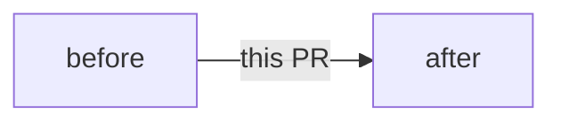

<!-- Title: like a commit subject, type(scope): imperative summary, at most 72 characters.
     Fill each table, add rows, delete example rows; delete a section the comment says is optional.
     No closing keywords anywhere but the closing lines at the end. -->

<!-- One or two sentences: what changes for a user or maintainer, and why. -->

## Changes

| Commit | What and why |
|---|---|
| `type(scope): …` | |

<!-- One commit: delete the table, its message is the detail. -->

<!-- Optional: when the change alters a flow (data, control, CI), show it. Delete otherwise. -->

## Acceptance criteria (#N)

| Criterion (as the issue words it) | Evidence (test name, command output, run link) |
|---|---|
| | |

## Verification

| Check | How | Result |
|---|---|---|
| Fails without the change | <!-- the mutation or revert --> | <!-- the failing test's message --> |
| Real run | <!-- the command --> | <!-- the lines that matter; before → after when output changes --> |
| Lint and tests | `npm run lint -- --max-warnings 3`, `npm test`, `(cd src-tauri && cargo clippy --lib --all-targets -- -D warnings)`, `(cd src-tauri && cargo test --lib)` | |
| Repo checks | `npm run format:check`, `npm run check:comments`, `(cd src-tauri && cargo fmt --check)`, others the change touches | |

## Limits and follow-ups

<!-- What isn't proven or covered, each with its issue. Delete the section if there's none. -->

| Limit | Issue |
|---|---|
| | #N |

## Sidebar

<!-- CONTRIBUTING.md › Sidebar and linked issues. Check before marking ready. -->

| Field | Value |
|---|---|
| Labels | the issue's `type:`, `area:`, `priority:` (+ `type: devops` for `.github/` or CI) |
| Milestone | the issue's |
| Assignee | |
| Board 7 | In review |

Fixes #N
<!-- One line per issue this PR completes, each on its own line; an attribution line (e.g. Claude Code's 🤖 line) may follow. A PR that delivers one part of a larger
     issue closes that part's sub-issue: "Fixes #sub", then "Refs #parent".
     Never write fix/close/resolve + #N in a sentence or a table: GitHub links it and closes that issue. -->
