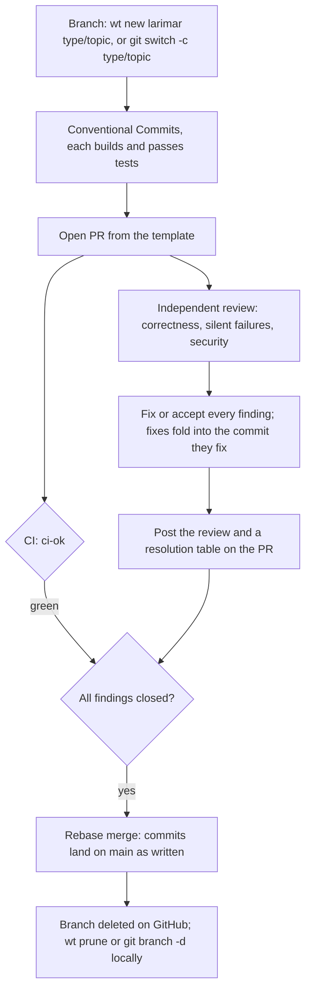

# Contributing to Moldavite

Thanks for helping improve Moldavite. The project is a local-first desktop app for macOS, Windows and Linux, so
changes that touch notes, paths, encryption, plugins, or agent access should be
reviewed as changes to user data or a trust boundary.

## Development setup

Prerequisites:

- Node.js 20 (the version in `.nvmrc` and `mise.toml`; `package.json` accepts
  `^20 || ^22`, and CI runs 20). On newer Node, vitest fails to give jsdom's
  globals to the test context and a couple of hundred tests fail for reasons
  unrelated to the code. With [mise](https://mise.jdx.dev), `mise install` in
  the checkout provides it (`node --version` prints `v20.x`).
- Rust 1.88 or newer (the `rust-version` in `src-tauri/Cargo.toml`)
- Xcode Command Line Tools on macOS; on Linux, the apt packages listed in the
  `build-linux` job of `.github/workflows/ci.yml`
- For the iPhone and iPad build: full Xcode, the iOS Rust targets, CocoaPods and
  the rustup `llvm-tools` component, as listed in
  [docs/MOBILE.md](docs/MOBILE.md#building-and-running)

### Arch Linux and CachyOS

The `build-linux` apt list maps to these packages:

```bash
sudo pacman -S --needed base-devel curl wget file openssl gtk3 webkit2gtk-4.1 \
  libayatana-appindicator librsvg patchelf
```

Rust comes from rustup or Arch's `rust` package.

### Build and run

Clone the repository, install dependencies, and start Tauri with frontend hot
reload:

```bash
git clone https://github.com/mauropereiira/Moldavite.git
cd Moldavite
npm install
npm run tauri dev
```

Useful commands:

```bash
npm test                                  # Frontend tests (Vitest)
(cd src-tauri && cargo test)              # Rust tests, including stress tests
npm run lint                              # TypeScript/React ESLint checks
npm run format:check                      # Prettier check
(cd src-tauri && cargo clippy --all-targets -- -D warnings)
npm run build                             # Frontend production build
npm run tauri build                       # Packaged app (DMG on macOS, EXE and MSI on Windows;
                                          #   add --bundles appimage deb rpm on Linux)
```

Run the checks relevant to your change while iterating. Before requesting review,
run both test suites and the lint/format checks. Changes to Rust should also pass
Clippy with warnings denied.

## Where things live

[docs/ARCHITECTURE.md](docs/ARCHITECTURE.md) shows how the entrypoints, the
MCP path and the plugin sandbox fit together. The current feature status,
storage model, and known debt are documented in
[docs/PROJECT_STATUS.md](docs/PROJECT_STATUS.md). Keep both accurate when
architecture or commands change.

- `src/components/` contains React UI grouped by feature.
- `src/hooks/` owns component-facing effects and workflow orchestration.
- `src/stores/` contains Zustand state; persistent state is Forge-namespaced where
  appropriate.
- `src/lib/fileSystem.ts` is the frontend HTML/Markdown and Tauri IPC boundary.
- `src/lib/plugins/` contains the sandboxed Worker host, wire protocol, validation,
  and permission-enforced plugin API.
- `src-tauri/src/commands/` contains backend commands grouped by domain.
- `src-tauri/src/persist.rs`, `validation.rs`, and `paths.rs` contain shared
  filesystem invariants.
- `src-tauri/src/mcp/` contains the headless, stdio MCP server.
- `docs/` contains design, plugin, release, project-status, and website docs.

## Code conventions

Follow the patterns already present in the file you are changing. In particular:

- Treat note display titles and disk addresses as different values. Daily and
  weekly notes use bare filenames; standalone notes use paths relative to `notes/`.
- Use the safe IPC wrapper on the frontend and validate every path-shaped argument
  again in Rust.
- Write user data through `persist::write_atomic`; do not use a bare file write.
- Preserve unknown YAML frontmatter when editing a note.
- Keep `slugifyNoteName` in `src/lib/fileSystem.ts` synchronized with
  `note_name_to_filename` in `src-tauri/src/wiki.rs`, including both mirror suites.
- Treat plugin source, manifests, Worker messages, network data, and MCP requests as
  untrusted. Do not expose raw Tauri IPC to plugins.
- Use `rustfmt` and Prettier rather than hand-formatting around their output.

### Comments

The default is no comment. Code that needs a sentence to be understood is usually
code that should be clearer, and a comment restating it is a second copy of the
same claim that nobody updates, so it drifts and starts lying. Two shipped
examples: a comment claimed a slash command did not insert a character it plainly
inserted, and a stylesheet comment described hover behaviour belonging to a
different class.

Before writing one, ask: **if I delete this, does a reader lose something they
could not recover from the code?**

Write a comment when it says *why*, not *what*:

- A security, correctness, platform or compatibility constraint that is not
  visible in the code. The WebKit versus Blink notes are the canonical example:
  two layout bugs shipped twice each because they were verified in Chrome, and
  those comments are why they did not ship a third time.
- A contract a signature cannot carry: addressing rules, lifecycle, what a
  parameter means when its type does not say.
- A measured number or a budget, with the measurement.
- A module or file header stating ownership and invariants.
- The justification for a tool directive, a legal notice, a generated-file warning.

Do not write:

- A restatement of the line below it, or a header that repeats the identifier.
- Step narration: "First validate", "Then build", "Finally return".
- Decorative banners. A rule of `=` or `-` around a section name is furniture,
  and `npm run check:comments` fails on them.
- Filler openers: "This function is responsible for", "Note that", "Simply".
- History. Git has it. A comment about a finished refactor is noise a year later.
- Commented-out code.

The same standard applies to anything generated by an assistant. Volume is the
tell: a file where every third line is narration hides the comments that matter.

## Tests and documentation

Add or update regression coverage with behavior changes. Preserve mirrored tests
when a contract exists in both Rust and TypeScript.

Follow the documentation-maintenance rules:

- User-visible changes need an entry under the upcoming version in `CHANGELOG.md`.
- Feature changes need corresponding updates in `README.md` and
  `docs/PROJECT_STATUS.md`.
- Plugin API or permission changes must update both `docs/PLUGINS.md` and
  `docs/plugins.html`, and the community directory's `docs/api.md` and
  `scripts/lib/rules.mjs` in
  [moldavite-plugins](https://github.com/mauropereiira/moldavite-plugins) in the
  same release.
- Website claims must stay aligned with shipped behavior.

Before opening a pull request, ask whether any documentation now describes behavior
that is no longer true. Fix it in the same pull request.

## Pull requests

Every change reaches `main` through this flow. The "Protect main" ruleset
enforces the pull request, the `ci-ok` check, resolved review threads and
rebase merging; nobody bypasses it.



| Rule | Why |
|---|---|
| **Rebase merges only** | History keeps each logical change; `git bisect` works per commit |
| **Every commit** follows [Conventional Commits](https://www.conventionalcommits.org/): `type(scope): summary` | Each lands on `main` as written |
| **Every commit builds and passes tests** | Bisectability; fold fixes into the commit they fix |
| **Independent review before merge**, every finding fixed or accepted with a reason, the review posted on the PR | A second pair of eyes without the author's context; the record stays with the change |
| **One feature or fix per PR**, no unrelated formatting or refactors | Reviewable size |
| **The PR body follows the [template](.github/pull_request_template.md)** | Acceptance evidence and proof that tests fail without the change in one place |
| **The sidebar matches the issue** (below) | Merging closes the right issue and keeps the board true |
| **No rebase just because `main` moved** | The ruleset doesn't require an up-to-date branch; rebase for a conflict |
| **Upstream changes arrive as ported commits** | While Phase 0 still takes upstream fixes ([ADR 0001](docs/adr/0001-hard-fork.md)), each one is cherry-picked and reworded into a Conventional Commit naming the upstream commit, with upstream's closing keywords removed: a merge commit can't land under linear history, and upstream's `Fixes #N` lines would close Larimar issues |

Include tests for new or corrected behaviour, the documentation the
maintenance rules above require, screenshots or a recording for visible UI
changes, and any security, migration, compatibility or user-data implications.

### Commits

| Part | Rule |
|---|---|
| Subject | `type(scope): summary` (scope optional), at most 72 characters, lower case after the colon, imperative ("add", not "added"), no full stop |
| Types | `feat`, `fix`, `docs`, `test`, `refactor`, `perf`, `build`, `ci`, `chore`, `style`, `revert`; `fix` is a bug users see (a CI bug is `ci`, a test-only change `test`) |
| Scope | the area, for example `core`, `markdown`, `mcp`, `ingest`, `sync`, `server`, `editor`, `search`, `updater`, `clipper`, `app`, `ios`, `packaging`, `adr`, `architecture`, `contributing`, `readme`, `release` |
| Body | why (what was wrong, with evidence), what (as behaviour), proof (the test, and that it fails without the change); wrapped at 72; required for `feat`, `fix`, `refactor`, `perf` |
| Footers | `Refs #N` or `Fixes #N`, one issue per line; `Co-Authored-By:` |

### Sidebar and linked issues

| Field | Value |
|---|---|
| Development | the issue, through `Fixes #N` on its own line at the end of the body; check with `gh pr view N --json closingIssuesReferences` |
| Labels | the issue's `type:`, `area:` and `priority:` labels, plus `type: devops` for `.github/` or CI |
| Milestone | the issue's |
| Assignee | the owner, for PRs Claude sessions open |
| Reviewers | `.github/CODEOWNERS` requests the owner on PRs they didn't open; PRs opened as the owner are gated by the independent review |
| Projects | [board 7](https://github.com/users/jiegui2025/projects/7), *In review* |

| Pitfall | Avoid it |
|---|---|
| An issue needs several PRs | split it into sub-issues, one per PR: each PR says `Fixes #<sub-issue>` and `Refs #<parent>`; close the parent by hand when its last part closes |
| A closing keyword in prose | GitHub closes an issue for *fix*, *close* or *resolve* (any form) followed by `#N` anywhere in a PR body or commit message, tables included. Write `Refs #N` or reword |

### Review comments

The independent review is one PR comment per round: the findings
(`| # | Finding | Severity | Resolution |`), then what was verified. Severities:
**blocking** (the PR goes back to draft), important, minor. Every row is fixed
or explicitly accepted with the reason, and every review thread is resolved
before merging.

### Large files

CI fails a pull request that adds or changes a file over 1 MiB, because git
keeps every blob forever. Builds and media belong in releases or Actions
artifacts. A deliberate exception goes in `.github/large-files-allowlist` as
`path  # reason`. To catch it before committing, install the same check as a
hook. It is shared by every worktree and replaces an existing pre-commit hook;
worktrees whose branch predates the script skip it:

```bash
hook="$(git rev-parse --git-common-dir)/hooks/pre-commit"
printf '#!/bin/sh\n[ -f scripts/check-large-files.mjs ] || exit 0\nexec node scripts/check-large-files.mjs --staged\n' > "$hook"
chmod +x "$hook"
```

## Good first areas

- Improve focused documentation or examples where an invariant is already tested.
- Add regression tests for pure helpers in `src/lib/` or small Zustand stores.
- Improve accessibility labels, keyboard behavior, or focus tests in existing UI.
- Reproduce and document a well-scoped issue before proposing a behavioral fix.
- Keep website or contributor documentation synchronized with existing features.

For larger features, plugin permissions, migrations, encryption, or filesystem
changes, open an issue first so the design and compatibility constraints can be
agreed before implementation.
