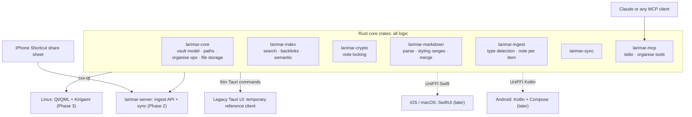
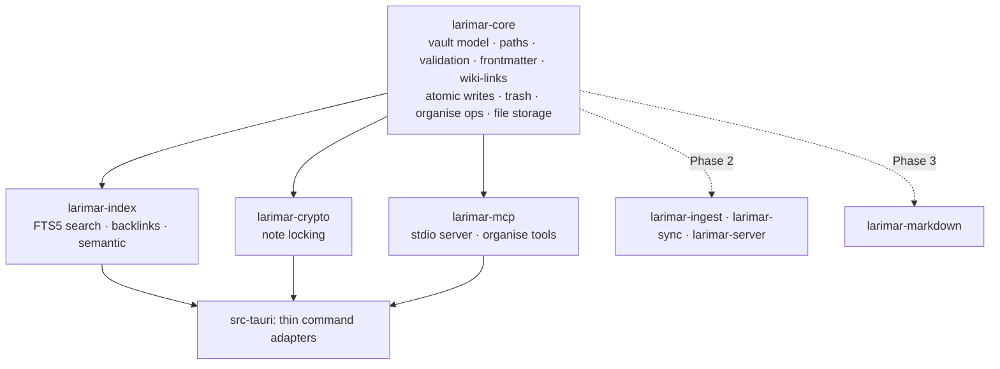
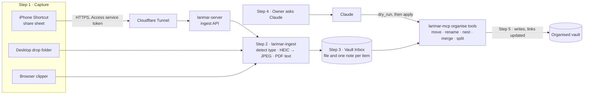
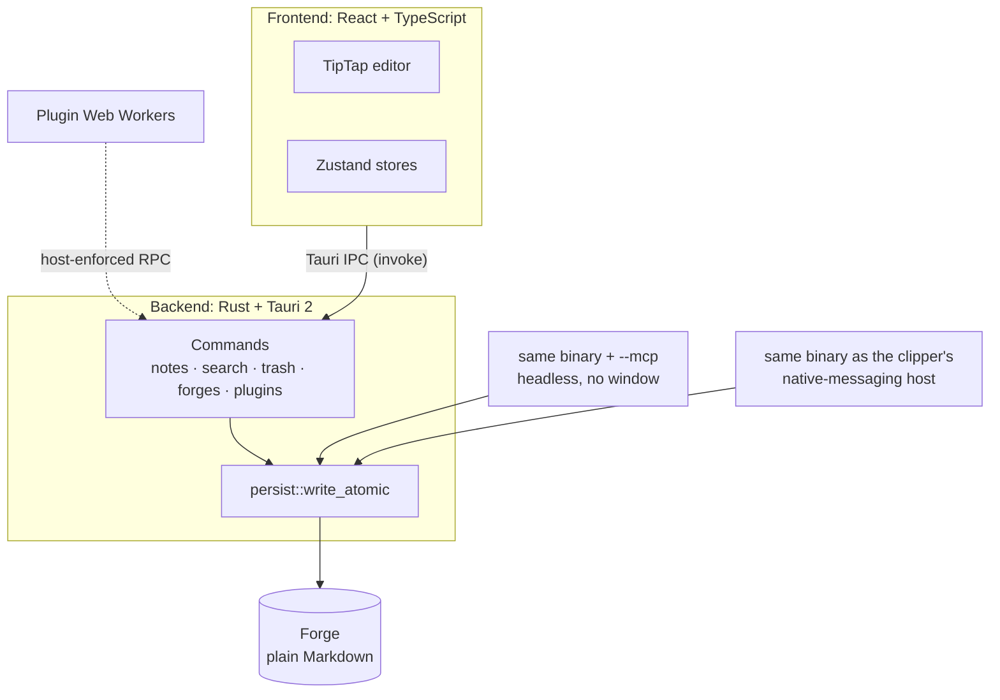

# Architecture

Larimar is a capture-anything personal vault: it receives anything shared from a desktop or an iPhone, creates a note per item, holds any file type, and lets Claude organise the vault through MCP on request, never by auto-sorting. It starts from a clone of an MIT-licensed Tauri notes app (credited in the README from [#16]) and moves all logic into Rust core crates with a native UI per platform.

Decisions are recorded as [ADRs](adr/README.md); the owner's requirements are on the pinned issue [#1]. For where to start editing, see [CONTRIBUTING.md](../CONTRIBUTING.md).

| Part | Today (`6996b61`) | Target | Decision |
|---|---|---|---|
| Logic | one Tauri crate plus TypeScript | Rust core crates, no UI types | [ADR 0002](adr/0002-rust-core-native-ui.md) |
| Linux UI | React + TipTap webview (legacy app) | Qt 6 / QML + Kirigami through cxx-qt | [ADR 0002](adr/0002-rust-core-native-ui.md), [#13] |
| Editor | TipTap rich text, HTML↔Markdown in TypeScript | Markdown source editor; Rust styling ranges | [ADR 0003](adr/0003-native-markdown-editor.md) |
| Platforms | macOS, Windows, Linux, iOS | Linux + server first; iOS, Android, macOS later; Windows last or never ([#14], planning session 2026-10-06) | [ADR 0004](adr/0004-platform-order-and-scope.md) |
| Storage | one local Forge of Markdown and images | plain-file vault of any type, ≥10 GB, synced, backed up | [ADR 0005](adr/0005-storage-sync-backup.md) (proposed) |
| Server | none | ingest API and sync on an Oracle Always Free VM behind Cloudflare | [ADR 0006](adr/0006-hosting.md) (proposed) |
| MCP | 7 notes-only tools | organise tools (move, rename, nest, merge, split) and any-file storage | [ADR 0009](adr/0009-delivery-order.md), [#19] |

## Rust core and native shells

| Shell | Bridge | When | Issue |
|---|---|---|---|
| Legacy Tauri app (React + TipTap) | `#[tauri::command]` adapters over core calls | now, until the Qt app reaches daily-use parity | [#11], [#13] |
| MCP server (`--mcp`) | links `larimar-mcp` | Phase 1 | [#19] |
| Linux app (Qt 6 / QML + Kirigami) | cxx-qt; validated first by a spike | spike in Phase 1, app in Phase 3 | [#20], [#13] |
| Server (`larimar-server`) | links the crates | Phase 2 | [#12] |
| iOS / iPadOS, macOS (SwiftUI) | UniFFI Swift | later | [#14] |
| Android (Kotlin + Compose) | UniFFI Kotlin | later | [#14] |
| Windows (WinUI 3) | UniFFI C# (third-party) | last or never (planning session 2026-10-06) | [#14] |

Core API rules ([#11] step 5): plain data types across the boundary, coarse calls (such as `capture(item)`), Rust-owned state with change events, and platform services (keyring, file watcher, clock) behind traits.

## Crate layout

Target of Phase 1 ([#11]); Phase 1 is also the hard-fork point ([ADR 0001](adr/0001-hard-fork.md)).

| Crate | Holds | Phase | Issue |
|---|---|---|---|
| `larimar-core` | vault model, paths, validation, frontmatter, wiki-links, atomic writes, trash, organise operations, any-file storage | 1 | [#11], [#19] |
| `larimar-index` | FTS5 search, backlinks, semantic index | 1 | [#11] |
| `larimar-crypto` | note locking | 1 | [#11] |
| `larimar-mcp` | stdio MCP server, organise tools (same `--mcp` flag) | 1 | [#11], [#19] |
| `larimar-ingest` | type detection, HEIC → JPEG, PDF text and OCR, a note per item | 2 | [#12] |
| `larimar-sync` | selective sync: metadata now, files on demand | 2 | [#12], [#23] |
| `larimar-server` | ingest API and sync endpoint | 2 | [#12] |
| `larimar-markdown` | parse, styling ranges, merge | 3 | [#13] |

How the legacy modules move ([#11] plan):

| Step | Legacy code | Goes to |
|---|---|---|
| 1 | `frontmatter`, `encryption`, `validation`, `security`, `secrets`, `templates_data` (no Tauri references) | `larimar-core`, unchanged |
| 2 | `cloud_forge` (holds a global `AppHandle`) | behind a storage-location trait; `grant_forge_asset_access` stays in the app |
| 2 | `paths`, `wiki`, `persist`, `backlinks_index` | core crates |
| 3 | logic inside `commands::notes`, `commands::folders`, `commands::forges`, `commands::search` | core; the Tauri commands become adapters |
| 3 | `mcp/` | `larimar-mcp` |
| 4 | new: organise tools and any-file storage | `larimar-core`, `larimar-mcp` ([#19]) |

## Data flow: capture → Inbox note → organise via MCP

| Step | What happens | Issue |
|---|---|---|
| 1. Capture | the iPhone share sheet runs a Shortcut that posts the item over HTTPS through Cloudflare Access and Tunnel; desktops use a drop folder or the browser clipper | [#12] |
| 2. Ingest | `larimar-ingest` detects the type, converts HEIC to JPEG, extracts PDF text | [#12] |
| 3. Inbox note | the file is stored in the vault with one note per item (type, size, source, capture date) in the Inbox | [#12], [#19] |
| 4. Request | nothing is sorted automatically: the owner asks Claude to organise | [#1] R2 |
| 5. Organise | MCP tools (`move_item`, `rename_item`, `create_folder`, `merge_notes`, `split_note`, `store_file`) run with a dry run first, only when writes are enabled; inbound wiki-links are updated; merged or split sources go to the trash | [#19] |

The legacy app picks up MCP changes through its existing Forge watcher. Sync to devices and encrypted backups are covered in [ADR 0005](adr/0005-storage-sync-backup.md) (proposed); hosting in [ADR 0006](adr/0006-hosting.md) (proposed).

## What Phase 0 removes or archives

Phase 0 ([#2]) turns the clone into a buildable Larimar without restructuring code. Target state of its issues:

| Upstream item | Action | Issue | Decision |
|---|---|---|---|
| Tauri iOS app (Xcode project, widget, iOS plugins, `tauri.ios.conf.json`, iOS code paths and docs) | the iCloud Swift package first moves out of the iOS plugin, as the macOS build links it; the rest is **archived** as branch `archive/tauri-ios` and tag `archive-tauri-ios-2.11.0`, restore steps in [docs/archive/tauri-ios.md](archive/tauri-ios.md); then removed from `main` | [#15] | D6, [ADR 0004](adr/0004-platform-order-and-scope.md) |
| Marketing website, privacy policy, store listings, site scripts | removed | [#15] | D3, [ADR 0004](adr/0004-platform-order-and-scope.md) |
| Mac iCloud release tooling, upstream's project-status doc | removed | [#15] | — |
| Windows installer CI job (`build-windows`) | removed | [#6] | D3, [ADR 0004](adr/0004-platform-order-and-scope.md) |
| `test-icloud` CI job | **kept** and required through `ci-ok`: the macOS build links the iCloud Swift package it tests; [#15] moves that package out of the iOS plugin and retargets the job | [#6], [#15] | [ADR 0004](adr/0004-platform-order-and-scope.md) |
| Release and Homebrew workflows | deleted; Larimar's own release workflow follows | [#6], [#17] | [ADR 0007](adr/0007-ci-and-runners.md) |
| Updater key and feed | replaced by Larimar's own key and feed (the updater fails closed without them) | [#5] | — |
| Runtime identity (dirs, keyring, scheme, clipper host, MCP name), plugin registry, OAuth apps | replaced or disabled | [#4] | [ADR 0008](adr/0008-no-upstream-compatibility.md) |
| Every other reference to the upstream name, including on-disk format strings | renamed; only the README credit line names upstream, checked in CI | [#4], [#16] | [ADR 0008](adr/0008-no-upstream-compatibility.md) |

## Legacy app (reference client)

The inherited Tauri app keeps working throughout Phase 1 on top of the new crates and is retired on Linux once the Qt app covers daily use ([#13] step 5). What it is today:

| Layer | Detail |
|---|---|
| Frontend | React 19, TypeScript, TipTap 3 editor (wiki-links, tags, slash commands), Zustand stores; HTML↔Markdown in `src/lib/fileSystem.ts` |
| Backend | Rust + Tauri 2, one crate in `src-tauri` (40,276 lines in `src/`) |
| Forge | a folder of plain Markdown notes and images; search index and activity log kept per Forge, outside it |
| Integrations | macOS Swift code: the EventKit, default-app and drag bridges (`src-tauri/src-swift`) and the iCloud Swift package (linked by [`build.rs:24-25`][buildrs]); Google Calendar and WordPress use upstream's OAuth apps today, and [#4] disables them until Larimar registers its own |

| Property | Detail |
|---|---|
| One binary, four entrypoints | the GUI; a headless MCP server (`--mcp`); the browser clipper's native-messaging host; the custom-scheme deep-link handler inside the GUI. `main.rs` picks the headless modes before Tauri starts, because both own stdin and stdout ([`main.rs:12`][main]) |
| MCP write gate | write tools are listed only when writes are enabled in Settings; the gate is re-read per request, so revoking takes effect on connected sessions ([`mcp/tools.rs:56-67`][wgate], [`:126-135`][wlist], [`mcp_settings.rs:15-16`][gate]) |
| Plugin sandbox | one Web Worker per plugin, no DOM, network globals or Tauri IPC; every capability crosses a host-enforced RPC bridge; consent is pinned to a SHA-256 of manifest plus code. Today the app fetches its plugin registry at runtime from upstream's account; [#4] disables it until Larimar has its own. See [PLUGINS.md](PLUGINS.md) |
| Atomic writes | every write to user data goes through `persist::write_atomic`: temp file (mode `0600` on Unix), fsync, rename, fsync of the directory on Unix ([`persist.rs:298`][atomic]) |
| Conflicts | if a file changed on disk while the editor held unsaved edits, the disk version is kept as a timestamped conflict copy |
| Frontmatter | unknown keys are round-tripped untouched |
| Files outside a Forge | Markdown opened from elsewhere is admitted to a session allowlist (`loose_files`), saved by opaque id with a conflict check; lossy files open view-only |

More on the legacy app: [FORGE.md](FORGE.md) (Forges), [CLIPPER.md](CLIPPER.md) (browser clipper), [PLUGINS.md](PLUGINS.md) (plugin API).

## Decision records

| # | Decision | Status |
|---|---|---|
| [0001](adr/0001-hard-fork.md) | Hard fork after Phase 0 | Accepted |
| [0002](adr/0002-rust-core-native-ui.md) | Rust core crates with a native UI per platform | Accepted (spike [#20] pending) |
| [0003](adr/0003-native-markdown-editor.md) | Native Markdown source editor | Accepted |
| [0004](adr/0004-platform-order-and-scope.md) | Platform order and scope | Accepted |
| [0005](adr/0005-storage-sync-backup.md) | Storage, sync and backup | Proposed |
| [0006](adr/0006-hosting.md) | Hosting | Proposed |
| [0007](adr/0007-ci-and-runners.md) | CI and runners | Accepted |
| [0008](adr/0008-no-upstream-compatibility.md) | No upstream compatibility, no upstream name | Accepted |
| [0009](adr/0009-delivery-order.md) | Delivery order | Accepted |

[#1]: https://github.com/jiegui2025/larimar/issues/1
[#2]: https://github.com/jiegui2025/larimar/issues/2
[#4]: https://github.com/jiegui2025/larimar/issues/4
[#5]: https://github.com/jiegui2025/larimar/issues/5
[#6]: https://github.com/jiegui2025/larimar/issues/6
[#11]: https://github.com/jiegui2025/larimar/issues/11
[#12]: https://github.com/jiegui2025/larimar/issues/12
[#13]: https://github.com/jiegui2025/larimar/issues/13
[#14]: https://github.com/jiegui2025/larimar/issues/14
[#15]: https://github.com/jiegui2025/larimar/issues/15
[#16]: https://github.com/jiegui2025/larimar/issues/16
[#17]: https://github.com/jiegui2025/larimar/issues/17
[#19]: https://github.com/jiegui2025/larimar/issues/19
[#20]: https://github.com/jiegui2025/larimar/issues/20
[#23]: https://github.com/jiegui2025/larimar/issues/23
[main]: https://github.com/jiegui2025/larimar/blob/6996b61/src-tauri/src/main.rs#L12
[gate]: https://github.com/jiegui2025/larimar/blob/6996b61/src-tauri/src/commands/mcp_settings.rs#L15-L16
[wgate]: https://github.com/jiegui2025/larimar/blob/6996b61/src-tauri/src/mcp/tools.rs#L56-L67
[wlist]: https://github.com/jiegui2025/larimar/blob/6996b61/src-tauri/src/mcp/tools.rs#L126-L135
[buildrs]: https://github.com/jiegui2025/larimar/blob/6996b61/src-tauri/build.rs#L24-L25
[atomic]: https://github.com/jiegui2025/larimar/blob/6996b61/src-tauri/src/persist.rs#L298
