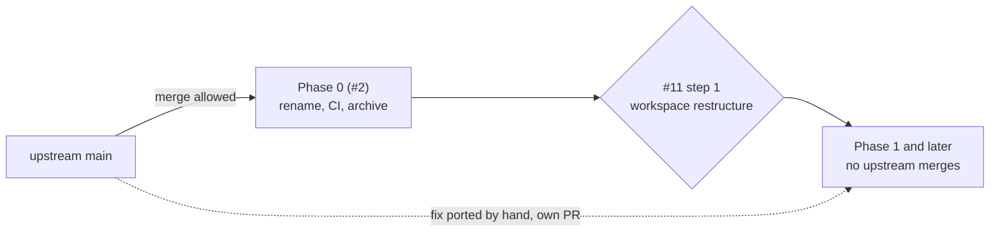

# 1. Hard fork after Phase 0

**Status:** Accepted (2026-10-06) — the owner, recorded on [#1] (*Decisions recorded with the owner*)

## Context

Larimar is a clone of the upstream app with its full history (credited in the README from [#16]), not a GitHub fork. Phase 0 makes it buildable under its own name; Phase 1 restructures the single Tauri crate into a Rust workspace ([#11]). After that, upstream patches no longer apply mechanically.

| Fact | Source |
|---|---|
| Upstream history at the clone: 501 commits since 2025-12-05, 133 in the 30 days and 302 in the 90 days before its last commit (2026-10-06); 500 of 501 by one author | `git log 6996b61` (counted 2026-10-07) |
| One package, one lib (`lib`, `cdylib`, `staticlib`), no `[workspace]` | [`src-tauri/Cargo.toml:1-14`][cargo] |
| 40,276 lines of Rust in `src-tauri/src`; only 6 modules are free of Tauri today | [#11] |
| `upstream` remote: push URL `DISABLED-do-not-push-upstream`, `tagOpt --no-tags` | `git remote -v`, `git config --get-regexp remote.upstream` (2026-10-07) |
| Every upstream identifier and format string is renamed in Phase 0 | [ADR 0008](0008-no-upstream-compatibility.md), [#4], [#16] |

| Requirement | Why |
|---|---|
| "Maybe we should consider fork the repotake this as the base and evolve" ([#1] I1) | upstream is the starting point, not a partner project |
| Clone rather than GitHub fork ([#1]) | allows going private later, separate git object storage, issues and Actions under Larimar's control |

## Decision

Upstream merges are allowed only until the workspace restructure starts ([#11] step 1). From then on Larimar is a hard fork: upstream is watched read-only and useful fixes are ported by hand.

| Phase | Upstream changes | How |
|---|---|---|
| Phase 0 ([#2]) | may be merged | `git fetch upstream` and a normal PR; conflicts with the renames in [#4] and [#16] are resolved in that PR |
| From [#11] step 1 | never merged | read upstream's log; port a fix by hand as a Larimar PR that names the upstream commit it ports |
| Always | never pushed | the `upstream` push URL stays disabled; upstream tags are never fetched |

## Consequences

| ✅ | ⚠️ |
|---|---|
| The core can be restructured without keeping upstream's file layout | upstream's fixes and features stop arriving for free; each one costs a manual port |
| No merge conflicts with a fast-moving single-maintainer project (133 commits in the 30 days before the clone) | someone has to watch upstream for security fixes, as nothing alerts Larimar automatically |
| History is kept, so `git blame` and old reasoning stay available | old commit messages mention upstream PR numbers (#1–#245), which GitHub autolinks to Larimar issues |
| Visibility, Actions and issues stay under Larimar's control (clone, not fork) | ported code must also be renamed ([ADR 0008](0008-no-upstream-compatibility.md)) |

## Evidence

- [#1] row I1 and *Decisions recorded with the owner*: "Hard fork after Phase 0: upstream merges stop once the Rust workspace restructure begins; useful upstream fixes are ported by hand"; "Clone rather than GitHub fork".
- [#2]: Phase 0 runs "without restructuring code yet (upstream merges still possible during this phase)".
- [#11]: "This is the hard-fork point (ADR 0001)"; measured coupling of the single crate.
- [`src-tauri/Cargo.toml:1-14`][cargo]: one package, no workspace.
- `git log 6996b61`, `git remote -v` on 2026-10-07 (numbers above).

[#1]: https://github.com/jiegui2025/larimar/issues/1
[#2]: https://github.com/jiegui2025/larimar/issues/2
[#4]: https://github.com/jiegui2025/larimar/issues/4
[#11]: https://github.com/jiegui2025/larimar/issues/11
[#16]: https://github.com/jiegui2025/larimar/issues/16
[cargo]: https://github.com/jiegui2025/larimar/blob/6996b61/src-tauri/Cargo.toml#L1-L14
