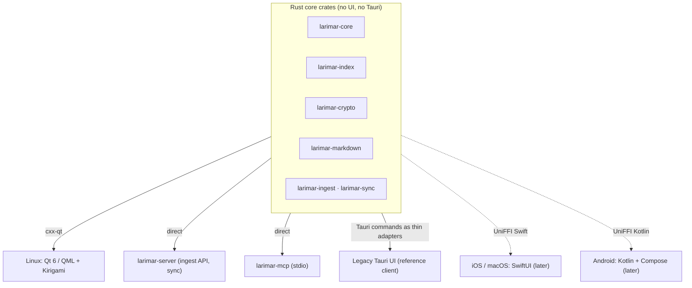

# 2. Rust core crates with a native UI per platform

**Status:** Accepted (2026-10-06) — the owner, [#1] E1–E3 (later platforms as recorded on [#14] from the same planning session); the cxx-qt spike [#20] validates it, and if cxx-qt binds poorly, a superseding ADR revises the API rules

## Context

Upstream is one Tauri 2 app: a React + TipTap webview over one Rust crate, with logic split between both sides. Larimar has to run on Linux and a server first and on phones later ([ADR 0004](0004-platform-order-and-scope.md)), and the owner wants native UIs.

| Fact | Source |
|---|---|
| Frontend: React 19, TipTap 3, Zustand; backend: Tauri 2.12 | [`package.json:75-88`][pkg], [`src-tauri/Cargo.toml:26`][tauri] |
| 40,276 lines of Rust in one crate; 15,402 of them in `#[tauri::command]` handlers; 6 modules free of Tauri | [#11] |
| The couplers: a global `OnceLock<AppHandle>` in `cloud_forge.rs`, `paths::grant_forge_asset_access(AppHandle)` | [`cloud_forge.rs:33`][cloud], [`paths.rs:153-163`][paths] |
| Markdown logic lives in TypeScript: `fileSystem.ts` (2,885 lines, HTML↔Markdown via `markdown-it` + `turndown`) | [`fileSystem.ts:17-19`][fs] |
| The same binary already runs headless as an MCP server (`--mcp`) | [`main.rs:12`][main] |
| UniFFI generates bindings with "full support for Kotlin, Swift and Python"; other languages through third-party bindings | [UniFFI user guide][uniffi] (fetched 2026-10-07) |
| CXX-Qt: "Safe interop between Rust and Qt", Qt 5.15 LTS and all Qt 6, `QObject` subclasses in Rust usable from QML | [CXX-Qt README][cxxqt] (fetched 2026-10-07) |

| Requirement | Owner's words ([#1]) |
|---|---|
| Shared Rust (E1) | "majority of the app on all platforms to be shared as Rust code with different wrappers" |
| Native UI (E2) | "I always want to have native lanaguage for the UI and rust to deal with code behind" |
| Linux toolkit (E3) | "Qt/QML + Kirigami" |

## Decision

All logic lives in Rust core crates with no UI or Tauri types. Each platform is a thin native shell over them. The inherited Tauri UI stays only as a temporary reference client.

| Shell | UI | Bridge | When |
|---|---|---|---|
| Linux desktop | Qt 6 / QML + Kirigami | cxx-qt | spike [#20] in Phase 1; app in Phase 3 ([#13]) |
| Server, CLI | none | links the crates | Phase 2 ([#12]) |
| MCP server | stdio JSON-RPC | links the crates | Phase 1 ([#11], [#19]) |
| Legacy app | React + TipTap in Tauri 2 | `#[tauri::command]` adapters over core calls | until the Qt app reaches daily-use parity ([#13] step 5) |
| iOS / iPadOS, macOS | SwiftUI | UniFFI Swift | later ([#14], planning session 2026-10-06) |
| Android | Kotlin + Jetpack Compose | UniFFI Kotlin | later ([#14]) |
| Windows | WinUI 3 (C#), last or never | UniFFI C# (third-party bindings) | last or never ([#14], planning session 2026-10-06) |

| Core API rule ([#11] step 5) | Why |
|---|---|
| Plain data types across the boundary | UniFFI and cxx-qt both bind them without custom glue |
| Coarse calls (`capture(item)`, `move_item(…)`) | fewer crossings; an iOS Share Extension has a small memory budget (about 120 MB, [#14]) |
| Rust owns the state and emits change events | every shell renders the same model; no logic copied into a UI |
| Platform services (keyring, file watcher, clock) behind traits | the core builds and tests without any platform |

**Validation:** [#20] builds a minimal Kirigami app calling Rust through cxx-qt (list model, change event, a styled text area) on CachyOS and on GitHub-hosted `ubuntu-24.04`. Its result is recorded here as the validation; if cxx-qt binds poorly, a superseding ADR revises the API rules before [#11] fixes the core's public API.

## Consequences

| ✅ | ⚠️ |
|---|---|
| One implementation of every vault rule, tested once (property and fuzz tests, [#11] step 6) | two bridge technologies (cxx-qt, UniFFI) to keep in step; the API must suit both |
| Native look and platform features (Kirigami on Linux, share sheets on phones) | every UI is written per platform: more UI code than one shared webview |
| Server, MCP and CLI reuse the same crates as the apps | cxx-qt with Kirigami is unproven here until [#20] reports |
| The legacy app keeps working during extraction ([#11] exit criteria) | the legacy UI's TypeScript Markdown logic and the Rust core coexist until Phase 3 ([ADR 0009](0009-delivery-order.md)) |

## Evidence

- [#1] rows E1, E2, E3 (owner's choices on 2026-10-06), E4, E5.
- [#11]: coupling measured on `6996b61`, target crate layout, API rules (step 5).
- [#13]: Phase 3 plan; open questions on cxx-qt maturity and Flatpak vs AppImage, answered by [#20].
- [#14]: platform, UI, bridge and CI table for the later platforms, including macOS later and Windows last or never, as picked by the owner in the 2026-10-06 planning session (E3 on [#1] points to these ADRs).
- [#20]: the spike and its acceptance criteria ("ADR 0002 updated with the result").
- Code at `6996b61`: [`package.json:75-88`][pkg], [`Cargo.toml:26`][tauri], [`cloud_forge.rs:33`][cloud], [`paths.rs:153-163`][paths], [`fileSystem.ts:17-19`][fs], [`main.rs:12`][main].
- External, fetched 2026-10-07: [UniFFI user guide][uniffi], [CXX-Qt README][cxxqt].

[#1]: https://github.com/jiegui2025/larimar/issues/1
[#11]: https://github.com/jiegui2025/larimar/issues/11
[#12]: https://github.com/jiegui2025/larimar/issues/12
[#13]: https://github.com/jiegui2025/larimar/issues/13
[#14]: https://github.com/jiegui2025/larimar/issues/14
[#19]: https://github.com/jiegui2025/larimar/issues/19
[#20]: https://github.com/jiegui2025/larimar/issues/20
[pkg]: https://github.com/jiegui2025/larimar/blob/6996b61/package.json#L75-L88
[tauri]: https://github.com/jiegui2025/larimar/blob/6996b61/src-tauri/Cargo.toml#L26
[cloud]: https://github.com/jiegui2025/larimar/blob/6996b61/src-tauri/src/cloud_forge.rs#L33
[paths]: https://github.com/jiegui2025/larimar/blob/6996b61/src-tauri/src/paths.rs#L153-L163
[fs]: https://github.com/jiegui2025/larimar/blob/6996b61/src/lib/fileSystem.ts#L17-L19
[main]: https://github.com/jiegui2025/larimar/blob/6996b61/src-tauri/src/main.rs#L12
[uniffi]: https://mozilla.github.io/uniffi-rs/latest/
[cxxqt]: https://github.com/KDAB/cxx-qt
