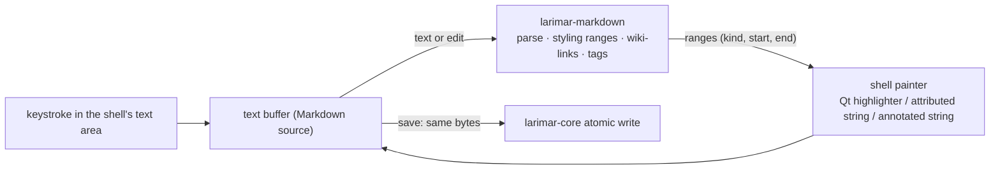

# 3. Native Markdown source editor; Rust computes styling, platforms paint

**Status:** Accepted (2026-10-06) — the owner picked "Native Markdown editor", [#1] E3

## Context

The legacy editor is TipTap 3 (rich text in a webview). Notes are stored as Markdown, so every open and save converts between the editor's HTML and Markdown in TypeScript. Native shells ([ADR 0002](0002-rust-core-native-ui.md)) cannot reuse a web editor, and each would otherwise need its own Markdown logic.

| Fact | Source |
|---|---|
| Editor: `@tiptap/react` and `@tiptap/starter-kit` 3.10 | [`package.json:75-76`][pkg] |
| HTML↔Markdown through `markdown-it` and `turndown` in `fileSystem.ts` (2,885 lines) | [`fileSystem.ts:17-19`][fs] |
| Markdown semantics already isolated: `markdownSource.ts` (310 lines), `markdownMerge.ts` (158), `noteConflicts.ts` (41); 10 `fileSystem.*.test.ts` suites (1,958 lines) | [`markdownSource.ts`][src], [`markdownMerge.ts`][merge], [#11] |
| Markdown files opened from outside a Forge are checked against the editor schema; lossy ones open view-only | [`docs/ARCHITECTURE.md:59`][fidelity] (upstream's text) |

| Requirement | Why |
|---|---|
| Native UI, Rust logic ([#1] E2) | parsing is logic, painting is UI |
| Linux first, then Apple and Android shells ([ADR 0004](0004-platform-order-and-scope.md)) | one parser must serve every shell |
| Plain-file vault ([ADR 0005](0005-storage-sync-backup.md)) | the file on disk is the note; no lossy round trip |

## Decision

Each shell edits the Markdown text itself. `larimar-markdown` (Phase 3, [#13]) parses it and returns styling ranges; the shell only maps range kinds to its toolkit's text attributes and paints them.

| Part | Does | Never does | Where |
|---|---|---|---|
| `larimar-markdown` | parses Markdown, returns styling ranges, finds wiki-links and tags, merges conflicting versions | paints, chooses fonts or colours | Rust, Phase 3 ([#13] step 2) |
| Shell painter | maps range kinds to text attributes; shows inline images | parses Markdown itself | QML `TextArea` with a `QSyntaxHighlighter`-style painter on Linux ([#13] step 3); SwiftUI and Compose later |
| Storage | writes exactly the text the user edited | converts to or from HTML | `larimar-core` |

## Consequences

| ✅ | ⚠️ |
|---|---|
| What is on screen is the file: no HTML↔Markdown loss, no view-only fallback for lossy files | not WYSIWYG: users see styled Markdown markup |
| One parser for every platform, testable with property tests and the TS suites as an oracle ([#13]) | styling runs on every keystroke across the bridge: needs incremental or fast full parses; first measured in [#20] (one paragraph), then [#13] |
| Unknown syntax and frontmatter survive untouched | Rust strings are UTF-8 while Qt, Swift and Kotlin index text in UTF-16: ranges need a conversion at each bridge |
| | the legacy UI keeps TipTap and its TypeScript conversion until it is retired ([ADR 0009](0009-delivery-order.md)) |

## Evidence

- [#1] row E3: Editor "Native Markdown editor"; row E2.
- [#13] steps 2–3: `larimar-markdown` port and the QML painter; HTML↔Markdown for TipTap is not ported.
- [#20] step 2: "A styled `TextArea` fed by Rust-computed ranges (the editor approach of ADR 0003), one paragraph only".
- [#11]: sizes of the TypeScript Markdown logic and its tests.
- Code at `6996b61`: [`package.json:75-76`][pkg], [`fileSystem.ts:17-19`][fs], [`markdownSource.ts`][src], [`markdownMerge.ts`][merge], [`docs/ARCHITECTURE.md:59`][fidelity].

[#1]: https://github.com/jiegui2025/larimar/issues/1
[#11]: https://github.com/jiegui2025/larimar/issues/11
[#13]: https://github.com/jiegui2025/larimar/issues/13
[#20]: https://github.com/jiegui2025/larimar/issues/20
[pkg]: https://github.com/jiegui2025/larimar/blob/6996b61/package.json#L75-L76
[fs]: https://github.com/jiegui2025/larimar/blob/6996b61/src/lib/fileSystem.ts#L17-L19
[src]: https://github.com/jiegui2025/larimar/blob/6996b61/src/lib/markdownSource.ts
[merge]: https://github.com/jiegui2025/larimar/blob/6996b61/src/lib/markdownMerge.ts
[fidelity]: https://github.com/jiegui2025/larimar/blob/6996b61/docs/ARCHITECTURE.md#L59
