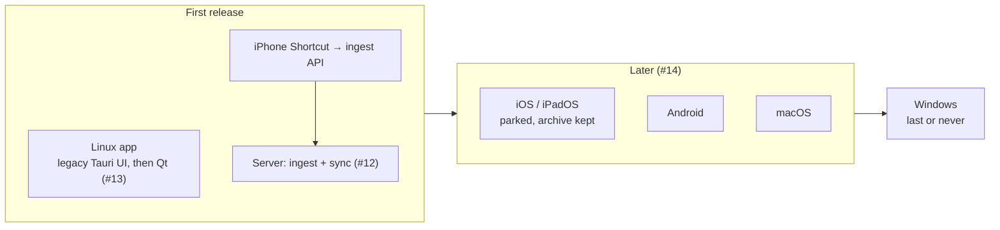

# 4. Platform order and scope: Linux and server first, iOS archived for later

**Status:** Accepted (2026-10-07) — platform order by the owner on 2026-10-06 ([#1] E3–E5; macOS later and Windows last or never picked in the same planning session, recorded on [#14]); Phase 0 scope by decisions [D3][D1-D4] and [D6][D5-D7] on 2026-10-07

## Context

Upstream ships desktop builds for macOS, Windows and Linux and a Tauri iOS app that was live on the App Store. The owner uses an iPhone, wants Linux first and parked the iOS app. Phase 0 has to decide what of upstream's platform surface stays on `main`.

| Fact | Source |
|---|---|
| Upstream's Tauri iOS app: Xcode project (33 files in `src-tauri/gen/apple`), widget and privacy manifest (`src-tauri/ios`), 4 plugins wired as crates only for iOS builds (931 lines of Rust, plus about 1,405 lines of Swift), `tauri.ios.conf.json`, `bundle.iOS` with upstream's Apple team | [`tauri.conf.json:108-111`][bundleios], [`Cargo.toml:93-102`][iosdeps], [#15] |
| The iCloud plugin's Swift package (`src-tauri/plugins/tauri-plugin-icloud/ios/Core`, "the iCloud Swift package") is **not** iOS-only: `build.rs` links it into the macOS desktop build next to the EventKit bridge | [`build.rs:24-25`][buildrs] |
| It reached the App Store (2.7.2, 2.9.1) | [`docs/IOS_APP_STORE.md`][appstore] |
| Upstream's iCloud "Synced Forge" is "still in development" | [`docs/MOBILE.md:429`][mobile] |
| Upstream's marketing website and privacy policy live in `docs/` (`*.html`, `site.js`, `styles.css`, site images, fonts), published by a script outside Actions | [`docs/index.html`][site], [`scripts/publish-site.sh`][publish], [#15] |
| `build-windows` does a full MSI + NSIS installer build on `windows-latest` (90-minute timeout) | [`ci.yml:180-227`][winjob] |
| `test-icloud` runs the Swift tests of the iCloud Swift package on `macos-latest` | [`ci.yml:21-30`][icloudjob] |
| Standard GitHub-hosted runners are free for public repositories | [GitHub Actions billing][billing] (fetched 2026-10-07) |

| Owner's words ([#1]) | Row |
|---|---|
| Order: "Linux + iOS first" | E3 |
| "we can also even park the iOS app initially as well" | E4 |
| "we can throw in the Android app as well since it does not care about physical runners" | E5 |
| "we should archive the iOS app but not removing it completely", "therefore we can catch up on it later"; chose "Git tag + branch" | D6 |

## Decision

| Order | Platform | Client | Phase |
|---|---|---|---|
| First | Linux desktop | legacy Tauri UI now; Qt/QML + Kirigami app ([ADR 0002](0002-rust-core-native-ui.md)) | now; Phase 3 ([#13]) |
| First | Server | ingest API and sync on the hosted VM ([ADR 0006](0006-hosting.md)) | Phase 2 ([#12]) |
| First | iPhone capture | iOS Shortcuts share sheet → ingest API; no app, no Mac needed | Phase 2 ([#12]) |
| Later (parked) | iOS / iPadOS app | SwiftUI + UniFFI, or the archived Tauri app restored and renamed; decided when [#14] starts | later |
| Later | Android | Kotlin + Compose, built on GitHub-hosted Linux runners | later ([#14]) |
| Later | macOS | SwiftUI shared with iOS | later ([#14], planning session 2026-10-06) |
| Last or never | Windows | WinUI 3, last or never; its installer CI job is removed now (D3) | later or never ([#14], planning session 2026-10-06) |

**Phase 0 scope (D3, amended by D6):**

| Upstream item | Action | Issue |
|---|---|---|
| Tauri iOS app: `src-tauri/gen/apple`, `src-tauri/ios`, `src-tauri/plugins`, `tauri.ios.conf.json`, `bundle.iOS`, `cfg(target_os = "ios")` code, iOS docs and store assets | the iCloud Swift package first moves out of the iOS plugin to `src-tauri/src-swift-cloud` (otherwise the macOS build and `rust-macos` break); the rest is **archived** as branch `archive/tauri-ios` and annotated tag `archive-tauri-ios-2.11.0` at the last commit before removal, protected by a "Protect archives" ruleset, with restore steps in [`docs/archive/tauri-ios.md`](../archive/tauri-ios.md); then removed from `main` | [#15] |
| Marketing website, privacy policy, store listings, site scripts | removed (git history keeps them) | [#15] |
| `build-windows` installer CI job | removed (D3) | [#6] |
| `test-icloud` CI job | **kept** and required through `ci-ok`, because the macOS build links the package it tests; [#15] retargets it at the moved package | [#6] ([PR #24][pr24]), [#15] |
| `rust-windows`, `rust-macos` (clippy + tests) | kept while the code still targets those systems | [#6] |
| macOS Swift code: `src-tauri/src-swift` (EventKit, default app, drag) and the iCloud Swift package | kept in the legacy app | [#15] |

## Consequences

| ✅ | ⚠️ |
|---|---|
| The first release needs no Mac and no Apple account: the iPhone captures through Shortcuts | no offline capture or vault browsing on the iPhone until [#14] |
| The iOS work is kept: it can be restored, or used as a reference (widget, share flow, iCloud bridge) | the archive carries upstream's identity (Apple team, iCloud container, widget id); restoring needs a Larimar Apple team, App Group, iCloud container and the full rename of [ADR 0008](0008-no-upstream-compatibility.md) |
| A smaller rename surface for [#4] and [#16]; CI loses its slowest job | Windows installers are no longer built; Windows regressions are caught only by `rust-windows` |
| The core keeps phone constraints in view now: lean core, coarse `capture(item)` ([#14]) | upstream's website and privacy policy are gone; Larimar needs its own before any store listing (domain: [#22]) |

## Evidence

- [#1] rows E3, E4, E5, I3; decision [D3][D1-D4] (remove the iOS app, Windows installer job and website), amended by [D6][D5-D7] (archive, not delete, the iOS app).
- [#15]: inventory of the iOS app and website at `6996b61`, archive and restore plan.
- [#6] and [PR #24][pr24]: CI job plan; only `build-windows` is removed (D3), `test-icloud` is kept and required through `ci-ok`.
- [#12], [#13], [#14]: phases for server and capture, the Linux app, and later platforms; [#14] records macOS as later and Windows as last or never (planning session 2026-10-06; E3 on [#1] points to these ADRs).
- Code at `6996b61`: [`tauri.conf.json:108-111`][bundleios], [`Cargo.toml:93-102`][iosdeps], [`build.rs:24-25`][buildrs], [`ci.yml:21-30`][icloudjob], [`ci.yml:180-227`][winjob], [`docs/IOS_APP_STORE.md`][appstore], [`docs/MOBILE.md:429`][mobile], [`docs/index.html`][site], [`scripts/publish-site.sh`][publish].
- External, fetched 2026-10-07: [About billing for GitHub Actions][billing] ("free … for public repositories that use standard GitHub-hosted runners").

[#1]: https://github.com/jiegui2025/larimar/issues/1
[D1-D4]: https://github.com/jiegui2025/larimar/issues/1#issuecomment-6039592293
[D5-D7]: https://github.com/jiegui2025/larimar/issues/1#issuecomment-6040993173
[#4]: https://github.com/jiegui2025/larimar/issues/4
[#6]: https://github.com/jiegui2025/larimar/issues/6
[#12]: https://github.com/jiegui2025/larimar/issues/12
[#13]: https://github.com/jiegui2025/larimar/issues/13
[#14]: https://github.com/jiegui2025/larimar/issues/14
[#15]: https://github.com/jiegui2025/larimar/issues/15
[#16]: https://github.com/jiegui2025/larimar/issues/16
[#22]: https://github.com/jiegui2025/larimar/issues/22
[bundleios]: https://github.com/jiegui2025/larimar/blob/6996b61/src-tauri/tauri.conf.json#L108-L111
[iosdeps]: https://github.com/jiegui2025/larimar/blob/6996b61/src-tauri/Cargo.toml#L93-L102
[buildrs]: https://github.com/jiegui2025/larimar/blob/6996b61/src-tauri/build.rs#L24-L25
[pr24]: https://github.com/jiegui2025/larimar/pull/24
[appstore]: https://github.com/jiegui2025/larimar/blob/6996b61/docs/IOS_APP_STORE.md
[mobile]: https://github.com/jiegui2025/larimar/blob/6996b61/docs/MOBILE.md#L429
[site]: https://github.com/jiegui2025/larimar/blob/6996b61/docs/index.html
[publish]: https://github.com/jiegui2025/larimar/blob/6996b61/scripts/publish-site.sh
[winjob]: https://github.com/jiegui2025/larimar/blob/6996b61/.github/workflows/ci.yml#L180-L227
[icloudjob]: https://github.com/jiegui2025/larimar/blob/6996b61/.github/workflows/ci.yml#L21-L30
[billing]: https://docs.github.com/en/billing/managing-billing-for-your-products/managing-billing-for-github-actions/about-billing-for-github-actions
