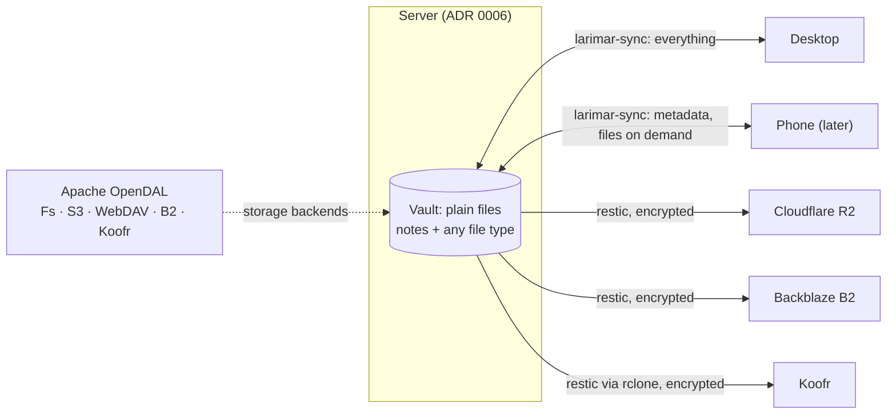

# 5. Storage, sync and backup: a plain-file vault, OpenDAL backends, restic backups

**Status:** Proposed (2026-10-07) — owner to confirm: (1) Apache OpenDAL for storage backends; (2) encrypted restic backups to Cloudflare R2 + Backblaze B2 + Koofr; (3) the sync protocol, chosen by the spike [#23]. The vault requirements in the first block of the decision table are already Accepted ([#1] R4, 2026-10-06).

## Context

Larimar must hold anything the owner captures, of any type and size, on a server and on devices, with phones holding only part of it. Upstream stores a Forge as a folder of Markdown notes and images on one device, with no sync.

| Fact | Source |
|---|---|
| Images accepted only as png, jpg, jpeg, gif, webp, svg; notes are `.md`, `.markdown`, `.mdown`, `.mkd`; HEIC appears nowhere | [`commands/misc.rs:310`][img], [`loose_files.rs:32`][md], [#19] |
| Search index and activity log live per Forge, outside the Forge | [`docs/ARCHITECTURE.md:152-153`][outside] (upstream's text) |
| No sync, server or ingest code; upstream's iCloud sync is "still in development" (and its iOS side is archived, [ADR 0004](0004-platform-order-and-scope.md)) | [`docs/MOBILE.md:429`][mobile], [#12] |
| GitHub: repositories ideally under 1 GB, under 5 GB strongly recommended; 10 GB on-disk limit; files over 100 MiB blocked | [About large files][ghlarge], [Repository limits][ghlimits] (fetched 2026-10-07) |
| GitHub releases: each file under 2 GiB; a public repository's releases are public | [About releases][ghrel] (fetched 2026-10-07) |
| Codeberg: up to 100 MB of private content for free-software contributors; ask first above 750 MiB of git storage; not meant for media backups | [Codeberg FAQ][codeberg] (fetched 2026-10-07) |
| OpenDAL services include `Fs`, `S3` (and S3-compatible), `Webdav`, `B2`, `Koofr`; R2 has no named service and goes through `S3` | [OpenDAL services][opendal] (fetched 2026-10-07) |
| restic backends include S3-compatible storage, Backblaze B2 (recommended through B2's S3-compatible API) and rclone; rclone has a Koofr backend; R2 "implements the S3 API" | [restic: preparing a repository][restic], [rclone Koofr][rclone], [R2 S3 API][r2] (fetched 2026-10-07) |
| Server disk budget: 200 GB block storage incl. boot | [ADR 0006](0006-hosting.md) |

| Option for the vault | ≥10 GB | Any file type | Phones hold a subset | Private |
|---|---|---|---|---|
| Git repository on GitHub or Codeberg | ❌ size limits, history never shrinks | ⚠️ 100 MiB per file | ❌ a clone holds everything | ⚠️ |
| Files as GitHub release assets | ✅ | ⚠️ 2 GiB per file | ⚠️ | ❌ public with the repo |
| **Plain files on the server, own sync, backends through OpenDAL** | ✅ | ✅ | ✅ (sync design, [#23]) | ✅ |

## Decision

| Part | Choice | Status |
|---|---|---|
| Vault format | plain files in folders: Markdown notes plus any file type ([#1] R1, R4), one note per captured item ([#1] R2; the sidecar note of [#19]) | Accepted ([#1] R1, R2, R4) |
| Not git | the vault is never a git repository or stored on a git forge | Accepted (R4) |
| Size | at least 10 GB | Accepted (R4) |
| Phones | selective sync: metadata first, files on demand | Accepted (R4) |
| Indexes | search and other indexes kept outside the vault and rebuildable from it | Proposed |
| Backends | Apache OpenDAL behind the storage-location trait that [#11] step 2 introduces | Proposed |
| Backups | restic, encrypted, from the server, to R2 (S3 API), B2 (S3-compatible API) and Koofr (rclone) | Proposed |
| History | restic snapshots and the trash, not git | Proposed |
| Sync protocol | own HTTPS protocol, Syncthing, or OpenDAL backends with a client index | open: spike [#23] |

**Owner to confirm:**

| # | Question | Default if confirmed |
|---|---|---|
| 1 | OpenDAL as the storage abstraction | `larimar-core` depends on OpenDAL for non-local backends |
| 2 | Backup targets R2 + B2 + Koofr | three providers, all independent of the hosting provider; restore tested from each |
| 3 | Sync protocol | decided in [#23] with a new ADR |

## Consequences

| ✅ | ⚠️ |
|---|---|
| Any file type and size; no git history growing forever | no built-in version history: past versions come from restic snapshots and the trash |
| Three backup providers, none of them the host | free-tier quotas and costs of R2, B2 and Koofr are not checked in this record |
| One backend API for local disk, S3-compatible stores, WebDAV and Koofr | OpenDAL is a large dependency; R2 is reached through its generic `S3` service |
| Phones keep only what they need | conflict handling and on-demand download are unsolved until [#23] |

## Evidence

- [#1] rows R1, R2, R4 ("For a vieable personal files storage valut, 10GB should be minimum standard"), R5, I4 (restic backups to R2 + B2 + Koofr).
- [#12] scope diagram (sync, backups), [#19] (any-file storage with sidecar notes), [#23] (sync options and criteria), [#11] step 2 (storage-location trait).
- Code at `6996b61`: [`commands/misc.rs:310`][img], [`loose_files.rs:32`][md], [`docs/MOBILE.md:429`][mobile], [`docs/ARCHITECTURE.md:152-153`][outside].
- External, fetched 2026-10-07 (first read during planning on 2026-10-06): [GitHub repository limits][ghlimits], [About large files on GitHub][ghlarge], [About releases][ghrel], [Codeberg FAQ][codeberg], [OpenDAL services][opendal], [restic: preparing a new repository][restic], [rclone Koofr backend][rclone], [Cloudflare R2 S3 API][r2].

[#1]: https://github.com/jiegui2025/larimar/issues/1
[#11]: https://github.com/jiegui2025/larimar/issues/11
[#12]: https://github.com/jiegui2025/larimar/issues/12
[#19]: https://github.com/jiegui2025/larimar/issues/19
[#23]: https://github.com/jiegui2025/larimar/issues/23
[img]: https://github.com/jiegui2025/larimar/blob/6996b61/src-tauri/src/commands/misc.rs#L310
[md]: https://github.com/jiegui2025/larimar/blob/6996b61/src-tauri/src/loose_files.rs#L32
[mobile]: https://github.com/jiegui2025/larimar/blob/6996b61/docs/MOBILE.md#L429
[outside]: https://github.com/jiegui2025/larimar/blob/6996b61/docs/ARCHITECTURE.md#L152-L153
[ghlimits]: https://docs.github.com/en/repositories/creating-and-managing-repositories/repository-limits
[ghlarge]: https://docs.github.com/en/repositories/working-with-files/managing-large-files/about-large-files-on-github
[ghrel]: https://docs.github.com/en/repositories/releasing-projects-on-github/about-releases
[codeberg]: https://docs.codeberg.org/getting-started/faq/
[opendal]: https://opendal.apache.org/docs/rust/opendal/services/index.html
[restic]: https://restic.readthedocs.io/en/stable/030_preparing_a_new_repo.html
[rclone]: https://rclone.org/koofr/
[r2]: https://developers.cloudflare.com/r2/api/s3/api/
