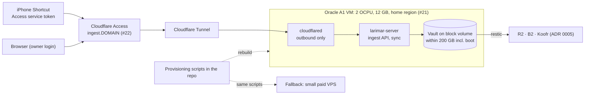

# 6. Hosting: Oracle Always Free Arm VM behind Cloudflare Tunnel and Access

**Status:** Proposed (2026-10-07) — owner to confirm: (1) Oracle Cloud Always Free Ampere A1 as the host, with a small paid VPS as the fallback; (2) the home region ([#21]; planning recommendation Montreal `ca-montreal-1`, fallback Frankfurt `eu-frankfurt-1`); (3) the domain for the ingest endpoint ([#22]); (4) whether to upgrade to Pay As You Go, knowing Oracle does **not** document that this exempts Always Free instances from idle reclamation; (5) Cloudflare Tunnel + Access in front of the API.

## Context

The ingest API ([#12]) must be reachable over HTTPS from the iPhone, hold a vault of at least 10 GB ([ADR 0005](0005-storage-sync-backup.md)) and cost little. The owner first said "Paid VPS / cloud", then asked about Oracle Always Free, Koofr and "a free option to run a private forgejo instance" ([#1] I4), and whether the VM could run a runner for private repositories (I5).

| Fact (Oracle, [Always Free resources][oracle], fetched 2026-10-07) | Value |
|---|---|
| Ampere A1 compute | first 1,500 OCPU hours and 9,000 GB hours per month free; for Always Free tenancies "equivalent to 2 OCPUs and 12 GB of memory" |
| Block storage | 200 GB total of boot and block volumes, **in the home region** only; 5 volume backups |
| Outbound data | 10 TB per month |
| Idle reclamation | an Always Free instance may be reclaimed if, over 7 days, CPU utilisation at the 95th percentile, network utilisation and (A1 only) memory utilisation are **each below 20%** |
| Pay As You Go | the page says **nothing** about paid or Pay As You Go accounts being exempt from reclamation |

| Fact | Source |
|---|---|
| `cloudflared` "creates outbound-only connections to Cloudflare's global network"; no publicly routable IP needed | [Cloudflare Tunnel][tunnel] (fetched 2026-10-07) |
| The home region cannot be changed later; A1 capacity per region is anecdotal, the only reliable test is launching the VM | [#21] |
| `larimar.app`, `.dev` and `.com` are registered by others (checked 2026-10-06); no domain chosen | [#22] |

## Decision

| Part | Proposed choice |
|---|---|
| Host | Oracle Cloud Always Free, Ampere A1, 2 OCPU / 12 GB, in the home region chosen in [#21] |
| Disk | boot volume plus one block volume for the vault, within the 200 GB Always Free budget |
| Ingress | Cloudflare Tunnel (no inbound ports open on the VM) and Cloudflare Access: a service token for the iPhone Shortcut, the owner's identity for browsers; hostname `ingest.<domain>` once [#22] is decided |
| Loss of the VM | expected, not exceptional: the VM is rebuilt from provisioning scripts in the repository and the vault restored from restic ([ADR 0005](0005-storage-sync-backup.md)), both tracked in [#25]; nothing on the VM is the only copy |
| Idle reclamation | Pay As You Go is relied on only after Oracle confirms the exemption in its documentation or through support, recorded in [#21] and here |
| Fallback | a small paid VPS, provisioned by the same scripts |
| CI runner | optional, for private repositories only, isolated from vault data ([ADR 0007](0007-ci-and-runners.md)) |

**Owner to confirm:**

| # | Question | Where |
|---|---|---|
| 1 | Oracle Always Free A1 as host, paid VPS as fallback | this record |
| 2 | Home region (permanent) | [#21] |
| 3 | Domain for `ingest.<domain>` | [#22] |
| 4 | Pay As You Go upgrade, given the exemption is undocumented | [#21] |
| 5 | Cloudflare Tunnel + Access for ingress | this record |

## Consequences

| ✅ | ⚠️ |
|---|---|
| No compute cost for 2 OCPU / 12 GB; 10 TB of monthly egress is far above a personal vault's needs | a mostly idle personal server can fall below all three 20% thresholds, so Oracle may reclaim it; the Pay As You Go exemption is unverified |
| No inbound ports: Access checks every request before it reaches the VM | ingress, one backup target (R2) and DNS all depend on Cloudflare |
| The same scripts move the server to a paid VPS | the home region is permanent and A1 capacity there is not guaranteed |
| | 200 GB including the boot volume caps the vault on the VM; more needs paid block storage or object storage through OpenDAL |

## Evidence

- [#1] rows I4 (hosting, Oracle, Koofr), I5 (runner for private repositories), R2 and R5 (capture from the iPhone).
- [#12]: scope diagram (iPhone Shortcut → Cloudflare Tunnel → ingest API) and the open decisions [#21], [#22], [#23]; [#25]: provision the VM from scripts and prove a rebuild from backups.
- [#21]: region options and the Pay As You Go question; [#22]: domain options.
- External, fetched 2026-10-07: [Oracle Always Free resources][oracle] (all Oracle figures above), [Cloudflare Tunnel][tunnel].

[#1]: https://github.com/jiegui2025/larimar/issues/1
[#12]: https://github.com/jiegui2025/larimar/issues/12
[#21]: https://github.com/jiegui2025/larimar/issues/21
[#22]: https://github.com/jiegui2025/larimar/issues/22
[#23]: https://github.com/jiegui2025/larimar/issues/23
[#25]: https://github.com/jiegui2025/larimar/issues/25
[oracle]: https://docs.oracle.com/en-us/iaas/Content/FreeTier/freetier_topic-Always_Free_Resources.htm
[tunnel]: https://developers.cloudflare.com/cloudflare-one/connections/connect-networks/
