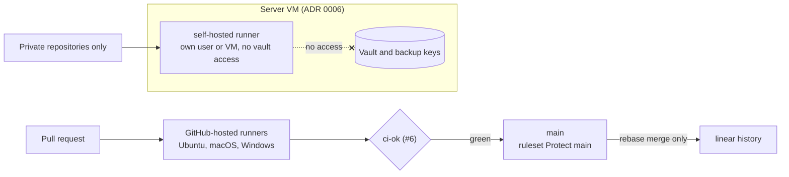

# 7. CI on GitHub-hosted runners while public; self-hosted runners only for private repositories

**Status:** Accepted (2026-10-06) — the owner, [#1] I2, I3, I5; repository process adopted the same day ("1 - OK", [#10]) and its rules applied on 2026-10-07

## Context

Larimar is public so that CI runs free on GitHub-hosted runners. Upstream's workflows release under upstream's identity and secrets, and the owner may later run a self-hosted runner on the server ([ADR 0006](0006-hosting.md)).

| Fact | Source |
|---|---|
| Standard GitHub-hosted runners are free for public repositories; larger runners are always billed | [About billing for GitHub Actions][billing] (fetched 2026-10-07) |
| "Self-hosted runners should almost never be used for public repositories on GitHub, because any user can open pull requests against the repository and compromise the environment" | [Security hardening for GitHub Actions][hardening] (fetched 2026-10-07) |
| Upstream `release.yml` fires on any `v*` tag and hard-codes upstream's Apple signing identity | [`release.yml:3-6`][reltrig], [`release.yml:203`][relid] |
| Upstream `homebrew-tap.yml` targets upstream's Homebrew tap | [`homebrew-tap.yml:3`][tap] |
| `ci.yml` uses no secrets, a read-only token, SHA-pinned actions | [`ci.yml:1-20`][ci], [#6] |
| Settings read on 2026-10-07: visibility public; merges rebase only, branches deleted on merge, auto-merge allowed; Actions enabled on purpose on 2026-10-07 while [#6]'s [PR #24][pr24] is open (safe: `v*` tag creation is blocked), with SHA pinning required, default token `read`, Actions cannot approve PRs | `gh api repos/jiegui2025/larimar`, `…/actions/permissions`, `…/actions/permissions/workflow` |
| Rulesets on 2026-10-07: "Protect main" (24656574) and "Protect release tags" (24656575), both active | `gh api repos/jiegui2025/larimar/rulesets` |

| Owner's words ([#1]) | Row |
|---|---|
| "I can make it stay public to take advantage of the free runners till we become much closer to the stablized version." | I2 |
| "for the iphone build, I think we will still need a self-hosted machine as runner anyways. but everything else can be done with GH free runners if we keep it a public repo." | I3 |
| "So it is an option to use it as self-hosted runner for private repo?" | I5 |

## Decision

| Rule | Detail | Applied |
|---|---|---|
| Runners while public | GitHub-hosted standard runners only | [#6] |
| Self-hosted runners | only for private repositories; never registered to this public repository; isolated from vault data and backup credentials | when a private repository needs one |
| Going private | re-plan runners first: hosted minutes become billed | before any visibility change |
| Upstream workflows | `release.yml` and `homebrew-tap.yml` deleted; `build-windows` job removed; `test-icloud` kept (the macOS build links the iCloud Swift package it tests) and, like every other job, required through the new `ci-ok` aggregate | [#6] ([PR #24][pr24]) |
| Actions settings | SHA pinning required, default token `read`, Actions cannot approve pull requests, approval for first-time contributors' fork PRs | [#6] |
| Merge methods | rebase only, branches deleted on merge, auto-merge allowed | 2026-10-07 ([#10]) |
| Ruleset "Protect main" (`~DEFAULT_BRANCH`) | pull request required (0 approvals, threads resolved, stale reviews dismissed, rebase only), linear history, no deletion, no force push; `ci-ok` required once [#6] is green | 2026-10-07; `ci-ok` pending ([#10]) |
| Ruleset "Protect release tags" (`refs/tags/v*`) | no deletion, update or force push; **creation blocked** until Larimar's release workflow exists, so upstream's `release.yml` can never fire | 2026-10-07; lifted by [#17] |
| Ruleset "Protect archives" | `archive/**` branches and `archive-*` tags cannot be deleted, updated or force-pushed | [#15] |
| Releases | Larimar's own workflow for signed Linux bundles | [#17] |

## Consequences

| ✅ | ⚠️ |
|---|---|
| Free CI on Linux, macOS and Windows while public | going private later makes hosted minutes billable; the runner plan must change first |
| Pull requests from forks never run on a machine that holds vault data | iOS builds need macOS hosted runners (free while public) or a Mac ([#1] I3, [#14]) |
| Upstream's release cannot fire: its workflow is deleted and `v*` tag creation is blocked | no tagged releases until [#17] lifts the tag block |
| Linear, reviewed history on `main` | `ci-ok` is not a required check until [#6] is green ([#10]) |

## Evidence

- [#1] rows I2, I3, I5; [#10] and its [decision comment][decision10] ("1 - OK").
- [#6] and [PR #24][pr24]: upstream workflow inventory, job plan (`test-icloud` kept and required), Actions settings; [#15]: "Protect archives" ruleset; [#17]: release workflow and the tag-creation block.
- Settings and rulesets read with `gh api` on 2026-10-07 (table above).
- Code at `6996b61`: [`ci.yml:1-20`][ci], [`release.yml:3-6`][reltrig], [`release.yml:203`][relid], [`homebrew-tap.yml:3`][tap].
- External, fetched 2026-10-07: [About billing for GitHub Actions][billing], [Security hardening for GitHub Actions][hardening] (section "Hardening for self-hosted runners").

[#1]: https://github.com/jiegui2025/larimar/issues/1
[#6]: https://github.com/jiegui2025/larimar/issues/6
[#10]: https://github.com/jiegui2025/larimar/issues/10
[decision10]: https://github.com/jiegui2025/larimar/issues/10#issuecomment-6029972380
[#14]: https://github.com/jiegui2025/larimar/issues/14
[#15]: https://github.com/jiegui2025/larimar/issues/15
[#17]: https://github.com/jiegui2025/larimar/issues/17
[pr24]: https://github.com/jiegui2025/larimar/pull/24
[ci]: https://github.com/jiegui2025/larimar/blob/6996b61/.github/workflows/ci.yml#L1-L20
[reltrig]: https://github.com/jiegui2025/larimar/blob/6996b61/.github/workflows/release.yml#L3-L6
[relid]: https://github.com/jiegui2025/larimar/blob/6996b61/.github/workflows/release.yml#L203
[tap]: https://github.com/jiegui2025/larimar/blob/6996b61/.github/workflows/homebrew-tap.yml#L3
[billing]: https://docs.github.com/en/billing/managing-billing-for-your-products/managing-billing-for-github-actions/about-billing-for-github-actions
[hardening]: https://docs.github.com/en/actions/security-for-github-actions/security-guides/security-hardening-for-github-actions
