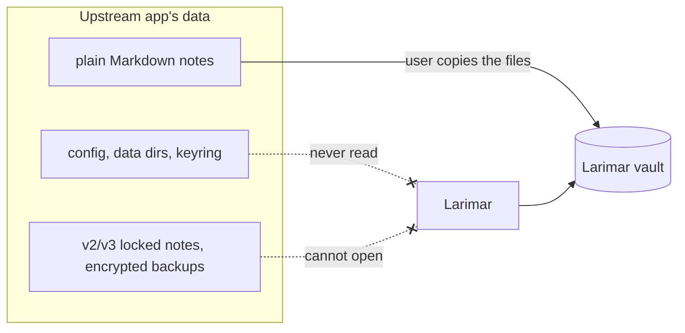

# 8. No upstream compatibility, no upstream name

**Status:** Accepted (2026-10-07) — the owner, decisions [D5 and D7][D5-D7] on [#1]; **supersedes D2** ([D1-D4])

## Context

The clone carries upstream's name in identifiers, on-disk formats, file names, assets and docs. A Larimar build would otherwise share state with an installed copy of the upstream app, and the two would be easy to confuse. D2 first kept upstream's on-disk format strings so upstream data could be imported once; the owner then chose to drop that import (D5).

| Fact | Source |
|---|---|
| Upstream's name: 1,658 hits in 253 files at the clone; about 1,000 hits in 211 files remain after the deletions of [#6] and [#15] | [D1-D4] review findings, [#16] |
| Shared state with an installed upstream app: product name and identifier (data, config, cache dirs, single-instance lock), keyring service, deep-link scheme, clipper native host, MCP server name | [#4] (e.g. [`secrets.rs:8`][keyring]) |
| Note-encryption AAD domain string (upstream name + `-note-v2`) | [`encryption.rs:28`][aad] |
| Encrypted-backup header and file extension carry the upstream name | [`export_import.rs:717`][hdr1], [`:753`][hdr2], [`:83`][ext1], [`:679`][ext2], [`exportDocument.ts:22`][ext3] |
| Settings export tags the file with the upstream app id | [`SettingsData.tsx:33`][set1], [`:199`][set2], [`:235`][set3] |
| Bundled plugin ids and folders carry the upstream name | [`commands/plugins.rs:544-545`][plug], [`src-tauri/example-plugin/`][plugdir] |
| Persisted storage keys are prefixed with the upstream name (e.g. the settings store) | [`settingsStore.ts:340`][store], [#16] |
| MIT requires keeping upstream's copyright notice | [`LICENSE:3`][license] |

| Decision on [#1] | Owner's words |
|---|---|
| D2 (superseded) | keep upstream's format strings so its data can be imported once |
| D5 | "we should also replace [upstream's name] completely throughout the codebase as well"; chose "Drop [upstream] import" (name elided here, as this record follows its own rule) |
| D7 | chose "One README credit line" |

## Decision

Larimar renames every upstream identifier, including on-disk format strings, never reads upstream's folders or encrypted data, and names upstream only in one README credit line.

| Area | Rule | Issue |
|---|---|---|
| Runtime identity | product `Larimar`, identifier `app.larimar`, own data and config dirs, keyring service `Larimar`, scheme `larimar://`, clipper host `app.larimar.clipper`, MCP server name `larimar` | [#4] |
| On-disk formats | note-encryption AAD → `larimar-note-v2`; backup header → `LARIMAR_ENCRYPTED_BACKUP_V1`; backup extension → `.larimar-backup`; settings export → `app: 'larimar'` | [#4] |
| Internal names | storage keys `larimar-*`, events, bundled plugin ids and folders (`larimar-example`, `larimar-wordpress`), file names, test fixtures | [#16] |
| Upstream data | no importer; Larimar never reads upstream's folders, config, keyring or encrypted data; plain Markdown notes copy over as files | [#4] |
| Name | only the README credit line names upstream; `LICENSE` keeps upstream's copyright line and adds Larimar's | [#16] |
| Enforcement | a step in `ci-ok` greps the tree, case-insensitively, for upstream's name and its owner's GitHub handle; the only allowed match is the README credit line | [#16] |
| History | git history is not rewritten; the archive branch and tag ([ADR 0004](0004-platform-order-and-scope.md)) keep the old names | [#15], [#16] |

## Consequences

| ✅ | ⚠️ |
|---|---|
| Larimar runs next to an installed upstream app without sharing config, data, keyring, deep links, MCP name or clipper host | upstream users cannot bring notes locked in the v2 or v3 format or encrypted backups; they must unlock and export plain Markdown in upstream first. Notes locked in the old unversioned format carry no AAD and still open until [#11] drops the legacy readers |
| No doubt about which app is which; CI keeps it that way | every upstream fix ported by hand must be renamed too ([ADR 0001](0001-hard-fork.md)) |
| The pre-V2 and V2 note-lock readers, kept only for upstream-era data, can be dropped when encryption moves into `larimar-crypto` ([#4], [#11]) | old commit messages and the archive still carry the name: the gate checks the tree, not history |
| No migration code: Larimar has no users or data yet | restoring the archived iOS app later means renaming it first |

## Evidence

- [#1]: [D2][D1-D4] (superseded), [D5 and D7][D5-D7].
- [#4]: runtime identity, endpoints and the format-string table; [#16]: remaining references, credit line, CI name gate.
- Code at `6996b61`: [`encryption.rs:28`][aad], [`export_import.rs:83`][ext1], [`:679`][ext2], [`:717`][hdr1], [`:753`][hdr2], [`exportDocument.ts:22`][ext3], [`SettingsData.tsx:33`][set1], [`:199`][set2], [`:235`][set3], [`commands/plugins.rs:544-545`][plug], [`settingsStore.ts:340`][store], [`secrets.rs:8`][keyring], [`LICENSE:3`][license].

[#1]: https://github.com/jiegui2025/larimar/issues/1
[D1-D4]: https://github.com/jiegui2025/larimar/issues/1#issuecomment-6039592293
[D5-D7]: https://github.com/jiegui2025/larimar/issues/1#issuecomment-6040993173
[#4]: https://github.com/jiegui2025/larimar/issues/4
[#6]: https://github.com/jiegui2025/larimar/issues/6
[#11]: https://github.com/jiegui2025/larimar/issues/11
[#15]: https://github.com/jiegui2025/larimar/issues/15
[#16]: https://github.com/jiegui2025/larimar/issues/16
[aad]: https://github.com/jiegui2025/larimar/blob/6996b61/src-tauri/src/encryption.rs#L28
[hdr1]: https://github.com/jiegui2025/larimar/blob/6996b61/src-tauri/src/commands/export_import.rs#L717
[hdr2]: https://github.com/jiegui2025/larimar/blob/6996b61/src-tauri/src/commands/export_import.rs#L753
[ext1]: https://github.com/jiegui2025/larimar/blob/6996b61/src-tauri/src/commands/export_import.rs#L83
[ext2]: https://github.com/jiegui2025/larimar/blob/6996b61/src-tauri/src/commands/export_import.rs#L679
[ext3]: https://github.com/jiegui2025/larimar/blob/6996b61/src/lib/exportDocument.ts#L22
[set1]: https://github.com/jiegui2025/larimar/blob/6996b61/src/components/settings/SettingsData.tsx#L33
[set2]: https://github.com/jiegui2025/larimar/blob/6996b61/src/components/settings/SettingsData.tsx#L199
[set3]: https://github.com/jiegui2025/larimar/blob/6996b61/src/components/settings/SettingsData.tsx#L235
[plug]: https://github.com/jiegui2025/larimar/blob/6996b61/src-tauri/src/commands/plugins.rs#L544-L545
[plugdir]: https://github.com/jiegui2025/larimar/blob/6996b61/src-tauri/example-plugin
[store]: https://github.com/jiegui2025/larimar/blob/6996b61/src/stores/settingsStore.ts#L340
[keyring]: https://github.com/jiegui2025/larimar/blob/6996b61/src-tauri/src/secrets.rs#L8
[license]: https://github.com/jiegui2025/larimar/blob/6996b61/LICENSE#L3
