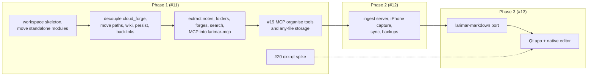

# 9. Delivery order: MCP organise tools before the Markdown port

**Status:** Accepted (2026-10-07) — the owner, decision [D4][D1-D4] on [#1]

## Context

The owner's core need is to capture anything and have Claude organise it through MCP on request ([#1] R1, R2). Phase 1 first planned to port the TypeScript Markdown logic to Rust; only the native editor ([ADR 0003](0003-native-markdown-editor.md)) needs that port, and the native editor arrives in Phase 3.

| Fact | Source |
|---|---|
| MCP has 7 notes-only tools (search, read, list, backlinks, create, append to daily note, write); no move, rename, folder, merge or split | [`mcp/tools.rs:147-153`][tools] |
| Write tools are listed only when `mcp_writes_enabled` is on (default off); the gate re-reads the setting on every request | [`mcp/tools.rs:56-67`][wgate], [`:126-135`][wlist], [`commands/mcp_settings.rs:15-16`][gate] |
| Rename and move logic exists, behind `#[tauri::command]` | [`commands/folders.rs:189`][renamef], [`:327`][movef], [`commands/notes.rs:1125`][renamen] |
| TypeScript Markdown logic: `fileSystem.ts` (2,885 lines; HTML↔Markdown for TipTap), `markdownSource.ts` (310), `markdownMerge.ts` (158), `noteConflicts.ts` (41); 10 `fileSystem.*.test.ts` suites (1,958 lines) | [`fileSystem.ts:17-19`][fs], [#11] |
| Only 3 of the 6 modules first listed as Tauri-free could move unchanged; `cloud_forge` couples the rest | [D1-D4] review findings, [#11] |

| Requirement | Owner's words ([#1]) |
|---|---|
| R2 | "can be sorted throgh MCP but not necessarily auto-sort, … auto create a note/folder which can be nested or consolidated or split with other folder and files through MCP" |
| D4 | Phase 1 order: core extraction → MCP organise tools + any-file storage; the TypeScript→Rust Markdown port moves to Phase 3 for the native editor only; the legacy UI keeps its TypeScript HTML↔Markdown |

## Decision

| Work | Phase | Notes |
|---|---|---|
| Core extraction ([#11] steps 1–3) | 1 | legacy app keeps passing its tests on top of the new crates |
| MCP organise tools and any-file storage ([#19]) | 1, first user-visible deliverable | `move_item`, `rename_item`, `create_folder`, `merge_notes`, `split_note`, `store_file`; each has a dry run; listed only when writes are enabled; never auto-sorts |
| cxx-qt spike ([#20]) | 1 | validates [ADR 0002](0002-rust-core-native-ui.md) before the core API is fixed |
| Markdown semantics in Rust (`markdownSource.ts`, `markdownMerge.ts`, `noteConflicts.ts`) | 3 (was 1) | for the native editor only; the TypeScript suites are the oracle ([#13] step 2) |
| HTML↔Markdown for TipTap (`fileSystem.ts`) | never ported | stays in TypeScript and goes away with the legacy UI |
| The clipper's in-browser `turndown` | never ported | stays in the extension |

## Consequences

| ✅ | ⚠️ |
|---|---|
| The owner's core need ships early and works with the legacy app and any MCP client | from Phase 3 until the legacy UI retires, Markdown rules exist twice (TypeScript and Rust) and must agree |
| No porting effort on code that dies with the legacy UI | `split_note` splits at headings, so Phase 1 needs some heading detection in Rust before `larimar-markdown` exists ([#19]) |
| The Phase 3 port has a ready oracle: 1,958 lines of TypeScript tests | the legacy UI keeps TipTap's lossy-file handling until it is replaced |

## Evidence

- [#1] rows R1, R2; decision [D4][D1-D4] (2026-10-07) and its review findings.
- [#11]: Phase 1 plan and measurements; [#19]: organise tools and acceptance criteria; [#13]: Phase 3 port scope; [#20]: spike.
- Code at `6996b61`: [`mcp/tools.rs:147-153`][tools], [`mcp/tools.rs:56-67`][wgate], [`:126-135`][wlist], [`commands/mcp_settings.rs:15-16`][gate], [`commands/folders.rs:189`][renamef], [`:327`][movef], [`commands/notes.rs:1125`][renamen], [`fileSystem.ts:17-19`][fs].

[#1]: https://github.com/jiegui2025/larimar/issues/1
[D1-D4]: https://github.com/jiegui2025/larimar/issues/1#issuecomment-6039592293
[#11]: https://github.com/jiegui2025/larimar/issues/11
[#12]: https://github.com/jiegui2025/larimar/issues/12
[#13]: https://github.com/jiegui2025/larimar/issues/13
[#19]: https://github.com/jiegui2025/larimar/issues/19
[#20]: https://github.com/jiegui2025/larimar/issues/20
[tools]: https://github.com/jiegui2025/larimar/blob/6996b61/src-tauri/src/mcp/tools.rs#L147-L153
[gate]: https://github.com/jiegui2025/larimar/blob/6996b61/src-tauri/src/commands/mcp_settings.rs#L15-L16
[wgate]: https://github.com/jiegui2025/larimar/blob/6996b61/src-tauri/src/mcp/tools.rs#L56-L67
[wlist]: https://github.com/jiegui2025/larimar/blob/6996b61/src-tauri/src/mcp/tools.rs#L126-L135
[renamef]: https://github.com/jiegui2025/larimar/blob/6996b61/src-tauri/src/commands/folders.rs#L189
[movef]: https://github.com/jiegui2025/larimar/blob/6996b61/src-tauri/src/commands/folders.rs#L327
[renamen]: https://github.com/jiegui2025/larimar/blob/6996b61/src-tauri/src/commands/notes.rs#L1125
[fs]: https://github.com/jiegui2025/larimar/blob/6996b61/src/lib/fileSystem.ts#L17-L19
