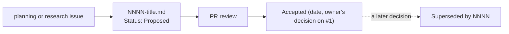

# Architecture decision records

Each record captures one significant decision as context → decision → consequences → evidence, mostly as tables and diagrams. The overview is [ARCHITECTURE.md](../ARCHITECTURE.md); the owner's own words are on the pinned requirements issue [#1](https://github.com/jiegui2025/larimar/issues/1).

| # | Decision | Status | Date |
|---|---|---|---|
| [0001](0001-hard-fork.md) | Hard fork after Phase 0 | Accepted | 2026-10-06 |
| [0002](0002-rust-core-native-ui.md) | Rust core crates with a native UI per platform | Accepted (spike [#20](https://github.com/jiegui2025/larimar/issues/20) pending) | 2026-10-06 |
| [0003](0003-native-markdown-editor.md) | Native Markdown source editor; Rust computes styling, platforms paint | Accepted | 2026-10-06 |
| [0004](0004-platform-order-and-scope.md) | Platform order and scope: Linux and server first, iOS archived for later | Accepted | 2026-10-07 |
| [0005](0005-storage-sync-backup.md) | Storage, sync and backup: a plain-file vault, OpenDAL backends, restic backups | Proposed | 2026-10-07 |
| [0006](0006-hosting.md) | Hosting: Oracle Always Free Arm VM behind Cloudflare Tunnel and Access | Proposed | 2026-10-07 |
| [0007](0007-ci-and-runners.md) | CI on GitHub-hosted runners while public; self-hosted runners only for private repositories | Accepted | 2026-10-06 |
| [0008](0008-no-upstream-compatibility.md) | No upstream compatibility, no upstream name (supersedes D2 on #1) | Accepted | 2026-10-07 |
| [0009](0009-delivery-order.md) | Delivery order: MCP organise tools before the Markdown port | Accepted | 2026-10-07 |

The date is the day the owner decided (Accepted) or the record was proposed (Proposed).

## Status

| Status | Meaning |
|---|---|
| Accepted | the owner decided; the record quotes or links the decision on #1 |
| Proposed | recommended in planning, not yet confirmed by the owner; the status line lists what the owner must confirm |
| Superseded by NNNN | replaced by a later record, which links back |

A decision isn't changed after acceptance: a new record supersedes it, and the old one's status says so. Records may be corrected for accuracy, or updated with a validation result they name (such as the spike in 0002), without changing the decision; a result that changes the decision gets a superseding record.

## Adding a record

1. Copy the layout of an existing record to `NNNN-short-title.md` with the next number and add its row above.
2. Sections: `# N. Short decision`, a `**Status:**` line, `## Context`, `## Decision` (a Mermaid diagram where it helps and a table), `## Consequences` (a ✅ / ⚠️ table), `## Evidence` (links to rows on #1, issues, permalinks to code, external docs with the date fetched).
3. Prefer tables and diagrams to prose; quote Mermaid labels that contain `#`, `:` or parentheses.
